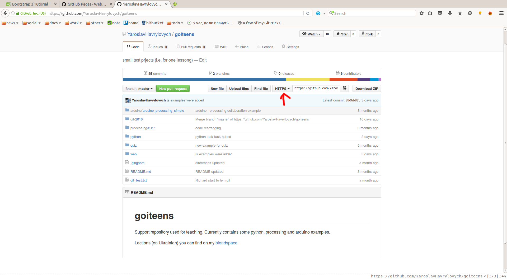

Завдання
========

##Bootstrap && github.io

Все доволі просто. 

*Bootstrap* - це (дуже спрощене і лиш те, що нам потрібно) css файл
в якому є вже відібрані і перевірені безліччю сайтів стилі, які гармонічно виглядають
між собою і доволі гарний вигляд матимуть на компі і на телефоні. Додатково bootstrap
має ще javascript файли, оскільки деякі елементи (такі як попапи), потребують його.

*github.io* - це метод створити, публічно доступну в інетрнеті, вашу сторінку на github.
Оформити її за вашим смаком і т.п.

###github.io
Спочатку створимо пусту сторінку і далі будемо її по-троху прикрашати.

1. Для того, щоб створти пусту сторінку, для початку потрібно буде зайти і
залогінитись на [github](https://github.com/), далі знайти на головній сторінці
кнопку _New repository_ і натиснути на неї. 

2. В полі _Repository name_ ви повинні набрати *ваш_логін.github.io* (репозитоій Public) і
натиснути кнопку _Create repository_.

3. Зараз у вас вже створено власний репозиторій, але поки відсутня його публічна сторінка.
Качаємо репозиторій собі на комп’ютер (аналогічно як ми робили це для ДЗ з
[html](https://github.com/YaroslavHavrylovych/goiteens/blob/master/web/html/2016/task.md)
та ін.) наступним чином:

    * Зайти на домашню сторінку.

    * З правої сторони у списку *Your repositories* знайти новостворений (в п. 2 є його назва) і
натиснути на нього (відкрити).

    * На сторінці репозиторію знати напис https як на картинці 
(якщо у вас там напис ssh, то натисніть і з меню як з’явиться вибрати https). Скопіювати адресу
яка знаходиться в цьому полі.

    * Відкрити git. За допомогою команди `cd` перейдіть в папку в якій знаходиться ваша
папка goiteens. Ви не повинні бути в папці goiteens, а бути в папці яка містить goiteens.
Нагадування: команда ls покаже вміст папка, команда pwd покаже папку, в які ви знаходитесь.

    * Далі набрати команду `git clone скопійована_адреса_HTTPS` (ту що ви скопіювали на github)
і enter.

    * Все, тепер репозиторій у вас на компі. Відповідно ви можете відкрити провідник і
перейти туди.

    * Створіть в папці вашого репозиторію файл, який називається `index.html`. Відкрийте цей
файл у блокноті і напишіть туди будь-який html код який придумаєте (аби-що пошвидше, можете просто
якусь фразу навіть).

    * Зебержіть файл і закрийте блокнот чи чим ви модифікували файл. Тепер по аналогії
із завданням [git](https://github.com/YaroslavHavrylovych/goiteens/blob/master/git/2016/task.md)
закомітьте (commit) файл локально і закиньте (push) його на сервер github (до цього ви ще додасте
змінені файли (add)).

    * В адресній строчці браузеру наберіть *http://ваш_логін.github.io* і ви повинні побачити
закомічені зміни.

###Bootstrap
